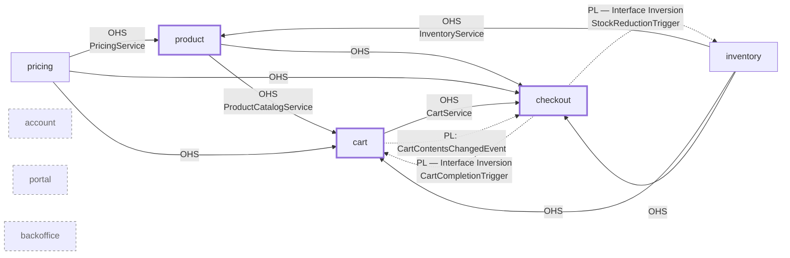

# Context Map

Strategic view of the bounded contexts in this reference implementation and how
they relate. Generated from `@BoundedContext` / `@ApplicationModule` annotations
and observed cross-context imports.

## Bounded Contexts

| Context | Responsibility | Subdomain |
|---|---|---|
| `product` | Product Catalog: master data, categories, composite-article aggregation | Core |
| `pricing` | Price determination and price-change tracking; OHS for other contexts | Supporting |
| `inventory` | Stock management and stock reduction | Supporting |
| `cart` | Shopping cart for guest and authenticated users | Core |
| `checkout` | Checkout process, payment orchestration, order confirmation | Core |
| `account` | User accounts, authentication, profile management | Supporting |
| `portal` | Storefront UI / cross-context views (aggregated client-side) | Generic (UI) |
| `backoffice` | Admin / operational views (e.g. event publication log) | Generic (Ops) — **not a business bounded context** |

The subdomain classification drives pattern choice and ArchUnit rule-set
strictness per context — see
[ADR-025: Pattern Selection per Subdomain Type](architecture/adr/adr-025-pattern-selection-per-subdomain.md).
(In this sample all contexts use the rich domain-model style for didactic
reasons; the ADR documents what a production system would relax.)

Shared Kernel: `sharedkernel/` contains the cross-cutting architectural markers
(`@BoundedContext`, `@OpenHostService`, `DomainEvent`, `IntegrationEvent`, ports)
and universal value objects (`ProductId`, `Money`, …). Deliberately kept small.

## Relationships

| Upstream | Downstream | Pattern | Realised via |
|---|---|---|---|
| `pricing` | `product` | Customer/Supplier (OHS) | `pricing.api.PricingService` → `product/adapter/outgoing/pricing/PricingDataAdapter` |
| `inventory` | `product` | Customer/Supplier (OHS) | `inventory.api.InventoryService` → `product/adapter/outgoing/inventory/InventoryStockDataAdapter` |
| `product` | `cart` | Customer/Supplier (OHS) | `product.api.ProductCatalogService` → `cart/adapter/outgoing/product/CompositeArticleDataAdapter` |
| `pricing` | `cart` | Customer/Supplier (OHS) | `pricing.api.PricingService` (via `CompositeArticleDataAdapter`) |
| `inventory` | `cart` | Customer/Supplier (OHS) | `inventory.api.InventoryService` (via `CompositeArticleDataAdapter`) |
| `product` | `checkout` | Customer/Supplier (OHS) | `product.api.ProductCatalogService` → `checkout/adapter/outgoing/product/*Adapter` |
| `pricing` | `checkout` | Customer/Supplier (OHS) | `pricing.api.PricingService` |
| `inventory` | `checkout` | Customer/Supplier (OHS) | `inventory.api.InventoryService` |
| `cart` | `checkout` | Published Language (events) | `cart.events.CartContentsChangedEvent` → `checkout/adapter/incoming/event/CartChangeEventConsumer` |
| `cart` | `checkout` | Customer/Supplier (OHS) | `cart.api.CartService` (lookups) |
| `checkout` | `cart` | Published Language — Interface Inversion | `checkout.events.CheckoutConfirmedEvent` *implements* `cart.events.CartCompletionTrigger`; consumer in `cart/adapter/incoming/event/CartCompletionEventConsumer` |
| `checkout` | `inventory` | Published Language — Interface Inversion | `checkout.events.CheckoutConfirmedEvent` *implements* `inventory.events.StockReductionTrigger`; consumer in `inventory/adapter/incoming/event/StockReductionEventConsumer` |
| `account` | (all) | Separate Ways | No direct code dependency; authentication flows via JWT / security filters (`infrastructure.security`) |
| `portal` | (all) | Separate Ways | Aggregation happens client-side; no Java cross-context imports |
| `backoffice` | (all) | Separate Ways | Consumes only Spring Modulith infrastructure (`JdbcEventPublicationLogStore`) |

### Pattern notes

- **Customer/Supplier (OHS):** The upstream context exposes a dedicated, narrow
  API package (`<context>/api/`). Spring Modulith makes it visible to other
  modules via `Type.OPEN`. The downstream context consumes the API only in its
  *outgoing-adapter* layer and translates the API types into its own domain
  model.
- **Published Language:** Integration events live in `<context>/events/` and are
  exposed under `<context> :: events`. Downstream consumers reside in
  `adapter/incoming/event/`.
- **Interface Inversion (a variant of Published Language):** The *consuming*
  context defines the event interface (e.g. `CartCompletionTrigger`); the
  *publishing* context implements that interface on its integration event
  (`CheckoutConfirmedEvent`). This removes any compile-time dependency from the
  consumer to the publisher.
- **Separate Ways:** No direct code or event dependencies.

## Diagram

**Legend:** Solid arrow = synchronous OHS call (REST / service); dotted arrow =
asynchronous integration event (Published Language). Thick-border nodes = core
subdomain; dashed-border nodes = Separate Ways (no compile-time cross-context
dependency).

## Notable design choices

1. **No Conformist relationships.** Each downstream context maps foreign API
   types into its own domain types inside the adapter layer — the domain code
   never sees types from `<other-context>.api`.
2. **No Anti-Corruption Layer (yet).** There is no foreign legacy context that
   would require an ACL. If an external system is integrated later, the
   corresponding outgoing adapter will be promoted to an ACL.
3. **Interface Inversion** is the preferred pattern whenever the publisher sits
   architecturally *below* the consumer — it prevents a backwards dependency
   without introducing a shared schema module.
4. **`backoffice` is explicitly not a bounded context**, but an operational
   module. Context-specific admin UIs (product editor, pricing maintenance)
   live inside their respective bounded contexts under `/backoffice/{context}/`.
5. **`portal` aggregates at the UI layer**, not in Java code. There is no
   backend aggregation service that joins multiple contexts.

## Maintenance

Run `/dca-core:context-map update` whenever:

- a new bounded context is introduced,
- a new OHS API or integration event is added,
- the `allowedDependencies` entry in a `package-info.java` changes,
- a synchronous/asynchronous switch takes place (e.g. OHS call → event).
