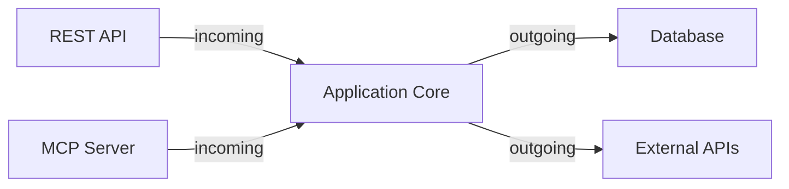

# E-Commerce Architecture

Sample Implementation with DDD & Clean Architecture

<div class="pt-12">
  <span @click="$slidev.nav.next" class="px-2 py-1 rounded cursor-pointer" hover="bg-white bg-opacity-10">
    Press Space for next page <carbon:arrow-right class="inline"/>
  </span>
</div>

---
transition: fade-out
---

# Architecture Patterns

This project demonstrates three complementary patterns:

- **Domain-Driven Design (DDD)** - Strategic & tactical patterns
- **Hexagonal Architecture** - Ports and Adapters
- **Clean Architecture** - Dependency inversion

<br>

## Tech Stack

- Java 21
- Spring Boot 3.5.6
- Gradle 9.1
- ArchUnit for architecture testing

---
layout: two-cols
---

# DDD Tactical Patterns

Core building blocks implemented:

- **Aggregates** - Consistency boundaries
- **Entities** - Objects with identity
- **Value Objects** - Immutable concepts
- **Repositories** - Persistence abstraction
- **Domain Events** - Business occurrences
- **Domain Services** - Stateless operations

::right::

```java
// Example Aggregate Root
public class Product
    extends BaseAggregateRoot<Product, ProductId> {

  private ProductName name;
  private Money price;
  private StockQuantity stock;

  public void changePrice(Money newPrice) {
    this.price = newPrice;
    registerEvent(
      ProductPriceChanged.now(id, newPrice)
    );
  }
}
```

---

# Package Structure

```
de.sample.aiarchitecture
├── domain.model              # Domain layer
│   ├── ddd                   # DDD marker interfaces
│   ├── product               # Product bounded context
│   └── cart                  # Shopping Cart bounded context
├── application               # Use cases
├── infrastructure            # Configuration
│   ├── api                   # Public SPI
│   └── config                # Spring setup
└── portadapter               # Adapters
    ├── incoming              # REST, Web, MCP
    └── outgoing              # Persistence
```

---
layout: center
---

# Hexagonal Architecture

Ports define contracts, adapters implement them



---

# Dependency Rules

Enforced by ArchUnit tests:

1. **Domain** → No dependencies (framework-independent)
2. **Application** → Depends on domain + infrastructure.api only
3. **Infrastructure** → Depends on domain
4. **Adapters** → Depend on application and domain
5. **Adapters** → Must NOT communicate directly

<br>

<v-click>

## Why This Matters

- Business logic independent of frameworks
- Easy to test domain in isolation
- Swap implementations without changing core
- Clear separation of concerns

</v-click>

---

# Architecture Testing

```groovy
@Test
void 'Aggregates must not reference other aggregates directly'() {
    classes()
        .that().implement(AggregateRoot)
        .should(notHaveFieldWithAggregateRootType())
        .check(importedClasses)
}

@Test
void 'Domain must not depend on Infrastructure'() {
    noClasses()
        .that().resideInAPackage('..domain..')
        .should().dependOnClassesThat()
        .resideInAPackage('..infrastructure..')
        .check(importedClasses)
}
```

Run with: `./gradlew test-architecture`

---

# Domain Events

Capture important business occurrences

```java
public record ProductPriceChanged(
    UUID eventId,
    Instant occurredOn,
    int version,
    ProductId productId,
    Money oldPrice,
    Money newPrice
) implements DomainEvent {

  public static ProductPriceChanged now(ProductId id, Money newPrice) {
    return new ProductPriceChanged(
      UUID.randomUUID(),
      Instant.now(),
      1,
      id,
      /* ... */
    );
  }
}
```

---

# Bounded Contexts

Two contexts in this sample:

<div grid="~ cols-2 gap-4">
<div>

## Product Catalog

- Product aggregate
- Product repository
- Inventory management
- Pricing

</div>
<div>

## Shopping Cart

- Cart aggregate
- Cart items
- Customer context
- Order placement

</div>
</div>

<br>

Contexts communicate via:
- Domain Events
- Application Services
- Anti-Corruption Layers

---
layout: center
class: text-center
---

# Key Principles

<v-clicks>

✅ Framework-independent domain layer

✅ Aggregates enforce business invariants

✅ Reference other aggregates by ID only

✅ Domain events capture facts in past tense

✅ Dependencies point inward toward domain

✅ Architecture rules enforced by tests

</v-clicks>

---
layout: end
---

# Thank You!

Questions?

Learn more: [docs/architecture/architecture-principles.md](../docs/architecture/architecture-principles.md)