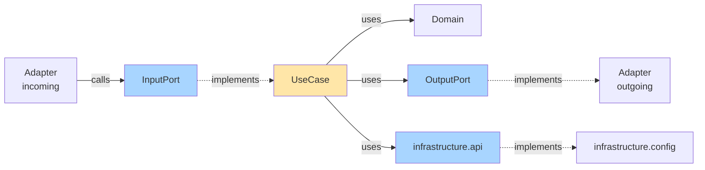

# Domain-Centric Architecture

E-Commerce Sample Implementation

<div class="pt-12">
  <span @click="$slidev.nav.next" class="px-2 py-1 rounded cursor-pointer" hover="bg-white bg-opacity-10">
    Press Space for next page <carbon:arrow-right class="inline"/>
  </span>
</div>

---
transition: fade-out
---

# Architecture Overview

Three complementary patterns working together:

- **Domain-Driven Design (DDD)** - Strategic & tactical patterns
- **Hexagonal Architecture** - Ports and Adapters
- **Clean Architecture** - Dependency inversion

<br>

## Tech Stack

- Java 21 with Records
- Spring Boot 3.5.6
- Gradle 9.1
- ArchUnit for architecture testing

---

# Agenda

<v-clicks>

1. **Bounded Context Schnitt** - Wie wir die Domäne aufteilen
2. **Usecase Pattern** - Application Layer Struktur
3. **Integration Events & ACL** - Context-übergreifende Kommunikation
4. **Infrastructure/Adapter Trennung** - Dependency Inversion in der Praxis
5. Dependency Rules & Testing

</v-clicks>

---
layout: section
---

# Bounded Context Schnitt

Wie wir die Domäne strukturieren

---

# Bounded Contexts im Projekt

Vier klare Kontexte mit eigenen Modellen:

<div grid="~ cols-2 gap-4">
<div>

## Product Catalog 🛍️
- Produktverwaltung
- Preisgestaltung
- Lagerbestand
- SKU Management

## Shopping Cart 🛒
- Warenkorb-Logik
- Cart Items
- Checkout-Prozess
- Bestellhistorie

</div>
<div>

## Portal 🌐
- Web-Oberfläche
- Navigation
- Cross-Context Views
- User Experience

## Shared Kernel 🔧
- Gemeinsame Value Objects
- DDD Marker Interfaces
- Common Types (Money, Price)
- Cross-Context IDs

</div>
</div>

---

# Package Struktur - Bounded Context Schnitt

```
de.sample.aiarchitecture
│
├── product/                     # Product Bounded Context
│   ├── domain/
│   ├── application/
│   └── adapter/
│
├── cart/                        # Shopping Cart Bounded Context
│   ├── domain/
│   ├── application/
│   └── adapter/
│
├── portal/                      # Portal Bounded Context
│   └── adapter/incoming/web/   # Cross-context UI
│
├── sharedkernel/               # Shared Kernel
│   ├── domain/marker/          # AggregateRoot, Entity, Value, DomainEvent
│   ├── domain/common/          # Money, Price, ProductId
│   └── application/marker/     # InputPort, OutputPort
│
└── infrastructure/             # Global infrastructure
    ├── api/                    # SPI für Application Layer
    └── config/                 # Spring Configuration
```

---

# Warum dieser Schnitt?

<v-clicks>

## Unabhängige Entwicklung
Jeder Context kann separat entwickelt und deployed werden

## Klare Verantwortlichkeiten
- **Product**: Was können wir verkaufen?
- **Cart**: Was will der Kunde kaufen?
- **Portal**: Wie präsentieren wir es?

## Vermeidung von Modellkonflikten
"Product" in Product Context ≠ "Product" in Cart Context
- Product Context: SKU, Lager, Preishistorie
- Cart Context: ProductId, Name, aktueller Preis (Snapshot)

## Skalierbarkeit
Contexts können später zu Microservices werden

</v-clicks>

---

# Context Isolation - Konkret

Jeder Context hat seine **eigene vollständige Struktur**:

````md magic-move
```
product/
├── domain/
│   ├── model/              # Product, SKU, Category, ProductStock
│   ├── event/              # ProductCreated, ProductPriceChanged
│   └── service/            # PricingService
├── application/
│   ├── port/in/            # CreateProductInputPort, GetProductInputPort
│   ├── port/out/           # ProductRepository
│   └── usecase/            # CreateProductUseCase, UpdatePriceUseCase
└── adapter/
    ├── incoming/           # REST API, Web UI, MCP Tools
    └── outgoing/           # InMemoryProductRepository
```

```
cart/
├── domain/
│   ├── model/              # ShoppingCart, CartItem, CartStatus
│   ├── event/              # CartCheckedOut, CartItemAdded
│   ├── service/            # CartTotalCalculator
│   └── spec/               # CartSpecification (Visitor Pattern)
├── application/
│   ├── port/in/            # AddItemToCartInputPort, CheckoutInputPort
│   ├── port/out/           # ShoppingCartRepository
│   └── usecase/            # AddItemToCartUseCase, CheckoutCartUseCase
└── adapter/
    ├── incoming/           # REST API, Web UI, Event Listeners
    └── outgoing/           # JPA/JDBC Repository Adapters
```
````

---
layout: section
---

# Usecase Pattern

Application Layer Struktur

---

# Usecase Pattern - Überblick

Klare Trennung zwischen **Contracts (Ports)** und **Implementation (UseCases)**

```
application/
├── port/                          # Interfaces (Contracts)
│   ├── in/  (Input Ports)         # Entry points - called by adapters
│   │   ├── CreateProductInputPort.java
│   │   ├── GetProductByIdInputPort.java
│   │   └── UpdateProductPriceInputPort.java
│   │
│   └── out/ (Output Ports)        # Dependencies - implemented by adapters
│       └── ProductRepository.java
│
└── usecase/                       # Implementations
    ├── createproduct/
    │   ├── CreateProductUseCase.java    # implements CreateProductInputPort
    │   ├── CreateProductCommand.java
    │   └── CreateProductResponse.java
    ├── getproductbyid/
    └── updateproductprice/
```

---
layout: two-cols
---

# Input Port

Interface = **Vertrag**

```java
package product.application.port.in;

public interface CreateProductInputPort
  extends InputPort<
    CreateProductCommand,
    CreateProductResponse
  > {

  CreateProductResponse execute(
    CreateProductCommand cmd
  );
}
```

::right::

# UseCase

Implementation

```java
@Service
public class CreateProductUseCase
  implements CreateProductInputPort {

  private final ProductRepository repo;
  private final ProductFactory factory;

  public CreateProductResponse execute(
    CreateProductCommand input
  ) {
    // 1. Validate
    // 2. Create
    // 3. Save
    // 4. Return
  }
}
```

---

# CreateProductUseCase - Flow

```java {all|4-6|9-11|13-14|16-17|all}
@Service
public class CreateProductUseCase implements CreateProductInputPort {

  private final ProductRepository repo;
  private final ProductFactory factory;
  private final DomainEventPublisher events;

  public CreateProductResponse execute(CreateProductCommand input) {
    // 1. Validate business rules
    if (repo.existsBySku(new SKU(input.sku())))
      throw new IllegalArgumentException("SKU exists");

    // 2. Create & save aggregate
    Product product = factory.createProduct(/* ... */);
    repo.save(product);

    // 3. Publish events & return
    events.publishAndClearEvents(product);
    return new CreateProductResponse(/* ... */);
  }
}
```

---

# UseCase Pattern - Vorteile

<v-clicks>

## 🎯 Klare Verantwortlichkeiten
- **Port**: Definiert WAS (Contract)
- **UseCase**: Implementiert WIE (Orchestration)

## 🔌 Dependency Inversion
- Adapter hängen von Port ab (Interface)
- Nicht von konkreter UseCase-Implementierung

## 🧪 Testbarkeit
```java
@Test
void shouldCreateProduct() {
  ProductRepository mockRepo = mock(ProductRepository.class);
  CreateProductUseCase useCase = new CreateProductUseCase(mockRepo, ...);

  CreateProductResponse response = useCase.execute(command);

  verify(mockRepo).save(any(Product.class));
}
```

## 📦 One UseCase = One Business Operation
Jede UseCase-Klasse macht **genau eine Sache**

</v-clicks>

---

# Command & Response Pattern

Input und Output sind **einfache DTOs** (Data Transfer Objects)

<div grid="~ cols-2 gap-4">
<div>

## Command (Input)

```java
public record CreateProductCommand(
    String sku,
    String name,
    String description,
    BigDecimal priceAmount,
    String priceCurrency,
    String category,
    int stockQuantity
) {
  // Validation in constructor
  public CreateProductCommand {
    if (sku == null || sku.isBlank()) {
      throw new IllegalArgumentException(
        "SKU cannot be empty"
      );
    }
    // ...
  }
}
```

</div>
<div>

## Response (Output)

```java
public record CreateProductResponse(
    String id,
    String sku,
    String name,
    String description,
    BigDecimal priceAmount,
    String priceCurrency,
    String category,
    int stockQuantity
) {
  // Immutable, no behavior
  // Pure data container
}
```

</div>
</div>

**Vorteile**: Keine Kopplung an Domain-Objekte, einfach zu serialisieren

---

# Output Ports - Dependencies

UseCase nutzt **Output Ports** für externe Abhängigkeiten

```java
// Output Port: Repository Interface in application/port/out/
// Implementation in adapter/outgoing/
package product.application.port.out;

public interface ProductRepository {
  Product save(Product product);
  Optional<Product> findById(ProductId id);
  Optional<Product> findBySku(SKU sku);
  boolean existsBySku(SKU sku);
  List<Product> findAll();
}
```

**Note:** DomainEventPublisher ist **kein** Output Port → siehe Infrastructure-Folien!

---
layout: section
---

# Integration Events & ACL

Context-übergreifende Kommunikation

---

# Domain Events vs Integration Events

Zwei verschiedene Event-Typen:

<div grid="~ cols-2 gap-4">
<div>

## Domain Events

**Innerhalb** eines Bounded Context

```java
package cart.domain.event;

public record CartCheckedOut(
    UUID eventId,
    Instant occurredOn,
    CartId cartId,
    Money totalAmount
) implements DomainEvent {
  // ...
}
```

- Implementiert `DomainEvent`
- Frei änderbar
- Keine Versionierung

</div>
<div>

## Integration Events

**Zwischen** Bounded Contexts

```java
package cart.adapter.outgoing.event;

// Separates DTO - endet mit "Event"!
public record CartCheckedOutEvent(
    UUID eventId,
    Instant occurredOn,
    int version,  // ← Versionierung!
    String cartId,
    BigDecimal total
) {
  // ...
}
```

- Separates **DTO**
- Name endet mit **"Event"**
- Versionierung erforderlich
- Via **ACL** konsumieren

</div>
</div>

---

# Anti-Corruption Layer (ACL)

**Problem**: Product Context soll auf Cart-Events reagieren, ohne von Cart-Struktur abhängig zu sein

<v-clicks>

## Ohne ACL ❌
```java
// Product context direkt abhängig von Cart-Event-Struktur
@EventListener
public void handle(CartCheckedOutEvent event) {
  event.items().forEach(item -> {
    // Wenn Cart die ItemInfo-Struktur ändert, bricht Product!
    reduceStock(item.productId(), item.quantity());
  });
}
```

## Mit ACL ✅
```java
// Product context nutzt ACL zur Übersetzung
@EventListener
public void handle(CartCheckedOutEvent event) {
  List<ReduceProductStockCommand> commands =
    cartEventTranslator.translate(event);  // ← ACL übersetzt!

  commands.forEach(reduceStockInputPort::execute);
}
```

</v-clicks>

---

# ACL Implementierung - CartEventTranslator

```java {all|8-14|20-26|33-38|all}
package product.adapter.incoming.event.acl;

/**
 * Anti-Corruption Layer: Übersetzt Cart-Events in Product-Commands
 */
@Component
public class CartEventTranslator {

  public List<ReduceProductStockCommand> translate(CartCheckedOutEvent event) {
    return switch (event.version()) {
      case 1 -> translateV1(event);
      case 2 -> translateV2(event);
      default -> throw new UnsupportedEventVersionException(
        "Unsupported version: " + event.version());
    };
  }

  private List<ReduceProductStockCommand> translateV1(CartCheckedOutEvent event) {
    return event.items().stream()
      .map(item -> new ReduceProductStockCommand(
        item.productId().value().toString(),
        item.quantity()
      ))
      .toList();
  }

  private List<ReduceProductStockCommand> translateV2(CartCheckedOutEvent event) {
    // Zukunft: v2 könnte zusätzliche Felder haben
    // - warehouse information
    // - batch numbers
    // - reservation IDs
    //
    // ACL extrahiert nur was Product braucht!
    return translateV1(event);  // Vorerst gleich wie v1
  }
}
```

---

# Warum ACL verwenden?

<v-clicks>

**🛡️ Isolation** - Product Context geschützt vor Cart-Änderungen

**🔄 Versionierung** - Mehrere Event-Versionen gleichzeitig

**🗣️ Übersetzung** - Cart's Sprache → Product's Sprache

**🧪 Testbarkeit** - ACL isoliert testbar

</v-clicks>

---
layout: section
---

# Infrastructure / Adapter Trennung

Dependency Inversion in der Praxis

---

# Infrastructure Struktur

Zwei wichtige Teile mit **unterschiedlichen Rollen**:

````md magic-move
```
infrastructure/
├── api/                           # Service Provider Interface (SPI)
│   └── DomainEventPublisher.java # ← Application hängt hiervon ab
│
└── config/                        # Implementations
    ├── SpringDomainEventPublisher.java  # ← Implementiert SPI
    ├── DomainConfiguration.java
    ├── SecurityConfiguration.java
    └── TransactionConfiguration.java
```

```java
// infrastructure.api - SPI
package infrastructure.api;

/**
 * SPI: Application layer depends on this interface
 */
public interface DomainEventPublisher {
  void publish(DomainEvent event);
  void publishAndClearEvents(AggregateRoot<?, ?> aggregate);
}
```

```java
// infrastructure.config - Implementation
package infrastructure.config;

/**
 * Implementation: Uses Spring's ApplicationEventPublisher
 */
@Component
public class SpringDomainEventPublisher implements DomainEventPublisher {

  private final ApplicationEventPublisher eventPublisher;

  @Override
  public void publish(DomainEvent event) {
    log.debug("Publishing: {}", event.getClass().getSimpleName());
    eventPublisher.publishEvent(event);
  }

  @Override
  public void publishAndClearEvents(AggregateRoot<?, ?> aggregate) {
    aggregate.domainEvents().forEach(this::publish);
    aggregate.clearDomainEvents();
  }
}
```
````

---

# Warum infrastructure.api?

<v-clicks>

## 📦 Application Layer bleibt framework-unabhängig

```java
// Application UseCase depends ONLY on interface
package product.application.usecase;

public class CreateProductUseCase {
  private final DomainEventPublisher eventPublisher;  // ← infrastructure.api

  public CreateProductResponse execute(CreateProductCommand cmd) {
    Product product = ...;
    productRepository.save(product);
    eventPublisher.publishAndClearEvents(product);  // ← kein Spring!
    return response;
  }
}
```

## 🔌 Dependency Inversion Principle

```
Application ──depends on──> infrastructure.api (interface)
                                      ↑
                                 implements
                                      |
                            infrastructure.config (Spring)
```

</v-clicks>

---

# Dependency Flow - Komplett



**Alle Pfeile zeigen nach innen** → Dependency Rule erfüllt!

---

# Adapter vs Infrastructure

<div grid="~ cols-2 gap-4">
<div>

## Adapter

**Zweck**: Externe Verbindungen

**Incoming**:
- REST/Web Controller
- Event Consumer

**Outgoing**:
- Repository Impl
- API Clients

**Dependencies**:
- Ports (in/out)
- Domain

</div>
<div>

## Infrastructure

**Zweck**: Framework & Config

**infrastructure.api**:
- DomainEventPublisher
- SPIs

**infrastructure.config**:
- Spring Boot
- DI/Transactions
- Security

**Dependencies**:
- Spring
- Domain

</div>
</div>

---

# Dependency Rules

Enforced by ArchUnit tests:

1. ✅ **Domain** → No dependencies (framework-independent)
2. ✅ **Application** → Depends on domain + `infrastructure.api` only
3. ✅ **Infrastructure.config** → Depends on domain + infrastructure.api
4. ✅ **Adapters** → Depend on application and domain
5. ❌ **Adapters** → Must NOT communicate directly with each other

<br>

```groovy
@Test
void 'Application Services must only use infrastructure.api'() {
    classes()
        .that().resideInAPackage('..application..')
        .should().onlyDependOnClassesThat()
        .resideInAnyPackage('..domain..', '..application..',
                             '..infrastructure.api..', 'java..')
        .check(importedClasses)
}
```

Run with: `./gradlew test-architecture`

---

# Architecture Testing Examples

```groovy {all|3-8|10-16|all}
class DddTacticalPatternsArchUnitTest {

  @Test
  void 'Aggregates must not reference other aggregates directly'() {
    classes().that().implement(AggregateRoot)
      .should(notHaveFieldWithAggregateRootType())
      .check(importedClasses)
  }

  @Test
  void 'Domain must not depend on Infrastructure'() {
    noClasses().that().resideInAPackage('..domain..')
      .should().dependOnClassesThat()
      .resideInAPackage('..infrastructure..')
      .check(importedClasses)
  }

  @Test
  void 'Value Objects must be immutable'() {
    classes().that().implement(Value)
      .should().haveOnlyFinalFields()
      .andShould().notHaveModifierOtherThan(PUBLIC, FINAL)
      .check(importedClasses)
  }
}
```

**16 test classes** mit **100+ architecture rules** → Architektur ist **executable**!

---
layout: center
class: text-center
---

# Zusammenfassung

<v-clicks>

**🎯 Bounded Context Schnitt** - Product, Cart, Portal, SharedKernel

**🔌 Usecase Pattern** - Port/In + Port/Out + UseCase

**📨 Integration Events & ACL** - Context-übergreifend mit Schutzschicht

**🏗️ Infrastructure/Adapter Trennung** - infrastructure.api vs. config

**✅ Architecture Testing** - ArchUnit enforces rules

</v-clicks>

---
layout: end
---

# Vielen Dank!

Fragen?

<div class="pt-4 text-sm opacity-75">

📖 Mehr Details: `docs/architecture/architecture-principles.md`

🔗 Referenz: https://github.com/chbloemer/implementing-domain-centric-architecture

🧪 Tests: `./gradlew test-architecture`

▶️ App starten: `./gradlew bootRun`

</div>